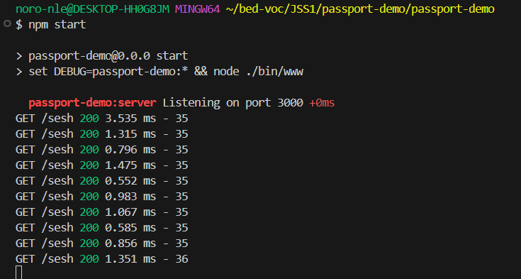
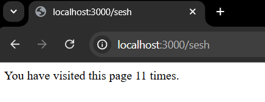
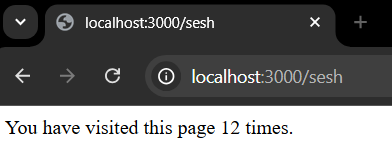
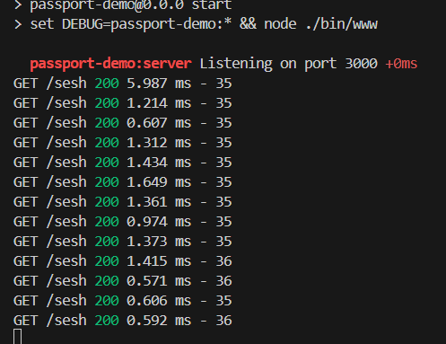
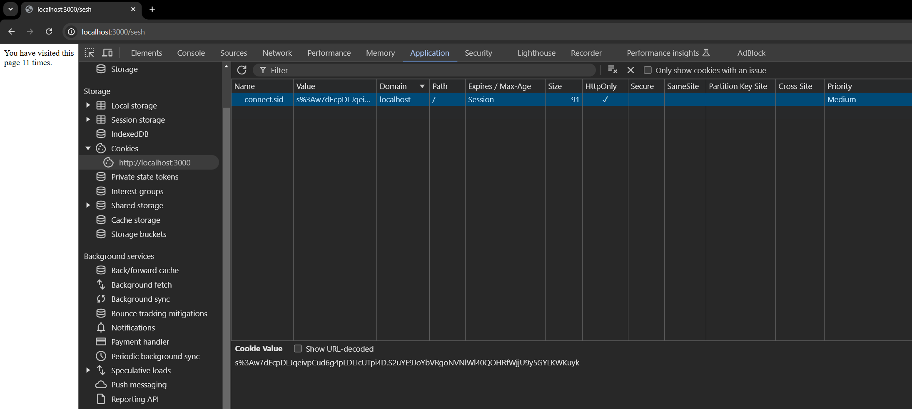

# PassportJS demo

This project uses the express-generator to create a template and then includes [PassportJS](https://www.npmjs.com/package/passport) and other needed dependencies to show:

- Local Strategy authentication (username and password)
- Session storage in memory (no persistence)
- User storage with passwords in plain text (JSON files)
- Route gaurding (endpoint protection)

## What are sessions and how do they enable authentication?

At a high level, sessions are a mechanism that allows a web application to "remember" users as they navigate across different pages or make multiple requests. When a user logs in, the server creates a session - a temporary data store tied to the user - and assigns it a unique ID, which is stored in a cookie on the user's browser. On each subsequent request, the browser sends this session ID back to the server, allowing the server to identify the user and maintain their authenticated state without requiring repeated logins. This approach, known as **stateful authentication**, relies on the server to store session data and is a cornerstone of traditional web application security.

In modern development, JSON Web Tokens (JWTs) have gained popularity for **stateless authentication**, where the user’s data is encoded into a token and sent to the client. Unlike sessions, which store data on the server, JWTs do not require server-side storage, making them suitable for distributed systems and APIs. However, sessions remain well-suited for browser-based applications due to their simplicity, built-in support in frameworks, and server-side control over authentication state.

**Note**: While stateful security works well for browser-based applications, it can be less practical for devices that lack cookie support, such as some mobile or IoT devices. In these cases, stateless methods like JWTs are often preferred, as they don't depend on browser-specific mechanisms like cookies.

## Installation

This project was created using the generator with the following command:

```bash
express passport-demo --ejs
```

Then navigate into the project and install all the relevent default dependencies, run the following:

```bash
cd passport-demo
```

```bash
npm i 
```

**Note**: This may require an additional `npm audit fix --force` command to update some packages to secure versions if you are re-creating this yourself.

You can run the application right away with:

```bash
npm start
```

But the `debug` dependency wont work as it requires an environment variable to be set. The easiest way to get it to work is to alter the `start` script, for windows change it to the following:

```json
"scripts": {
    "start": "set DEBUG=passport-demo:* && node ./bin/www"
},
```

And for Linux/macOS change it to the following:

```json
"scripts": {
    "start": "DEBUG=passport-demo:* && node ./bin/www"
},
```

This configures `debug` to work with any (`*`) namespace - `:server` is included in the template and can be seen in `bin/www`:

```js
...
var debug = require('debug')('passport-demo:server');
...
```

You can add other namespaces and create debuggers to help distinguish between different areas of your application, for example, if you want to make a debugger to log auth-related messages you can do the following in any script in your application:

```js
...
var authDebug = require('debug')('passport-demo:auth');
...

authDebug('User logged in');
```

Now you can run the application with `npm start` and see the debug logs.

## Passport-related dependencies

To do what we need to do for this project we need the following dependencies installed:

```bash
npm i passport passport-local express-session connect-ensure-login
```

These packages work together to enable our session-based security approach. It's important to note that the implementation in this assignment is very basic (plain text passwords, no databases) and could technically be accomplished without Passport. However, as applications grow in complexity and edge cases arise, a library like Passport becomes invaluable for managing authentication efficiently and securely.

**Note**: If time permits, I will create another repository demonstrating this authentication approach without additional dependencies (or possibly just using `express-session`). Seeing authentication stripped down to its bare bones, purely for educational purposes, can help clarify the core concepts.

The following sub-sections explain each dependency and how they contribute to the big picture of session-based authentication. Let’s start with the core: sessions.

### express-session

At its core, `express-session` is middleware that allows Express applications to manage session data. Recall, *"sessions enable a web application to remember users"* by storing relevant user data in something called a **session store**. Each entry in the session store is assigned a unique ID, and a cookie containing this ID is generated and sent to the user's browser. On each subsequent request, the browser sends this cookie back to the server, enabling the server to retrieve the corresponding session data. This prevents the user from having to log in every time they make a request to the server.

By default, sessions remain alive as long as the server is running. However, you can customize their lifespan by setting the `maxAge` field when configuring the session cookie (we dont need to do this yet). To invalidate a session, the session record is simply deleted from the store, requiring the user to log in again to continue using the application.

**Note**: Typically, sessions are configured to last for a few hours, but they can be extended to several days with "remember me" functionality.

From this, we can see there are two core components of session management: the **session store** and **cookie creation and parsing**.

Implementing these components manually is complex, even for simple use cases. Thankfully, `express-session` simplifies this process. In its default configuration, it:
1. **Stores sessions in memory** (suitable for development but not for production; in production, sessions are typically stored in a database or external store like Redis).
2. **Handles cookie creation and parsing**, ensuring the session ID is generated, sent to the browser, and retrieved from incoming requests to access session data.

All of this functionality is abstracted away, and we interact with it via the `req.session` object, making session management straightforward to use in code.

To enable and configure `express-session` with its default functionality, add the following to `app.js`:

```js
// app.js
...
const session = require('express-session');
...
app.use(
  session({
    secret: 'yourSecretKey', // Replace with a strong, random secret for signing the session ID
    resave: false, // Prevents session being saved back to the store unless modified
    saveUninitialized: false, // Prevents creating empty sessions for unauthenticated users
  })
);
```

While we aren't implementing proper secret management, I feel it is worth atleast gaining a conceptual understanding of this - as secrets are common in all areas of developement. 

In `express-session`, the **secret** is a key used to **sign** session cookies (create a cryptographic signature to ensure data integrity). This ensures that the server can **verify** the cookie and detect any **tampering**. Recall, when a session is created, a unique ID is generated and stored in the cookie - this is then signed using the key. On subsequent requests, the server checks the signature to confirm the cookie’s validity. If the cookie has been modified, the signature verification fails, and the session is invalidated.

Keeping the signing key secure is essential. If exposed, an attacker could forge valid cookies and impersonate users. To mitigate this risk:

- Use a strong, random value for the key.
- Store it securely in an environment variable rather than hardcoding it into your application.
- Rotate it periodically or in response to a potential security breach.

The other options (`resave` and `saveUninitialized`) just is more configuration for the data store. There is no additional cookie configuration leaving it as default. To customize how cookies are generated and parsed you can add an additional `cookie` field with various options. An example is shown below:

```js
app.use(
  session({
    secret: 'yourSecretKey',
    resave: false,
    saveUninitialized: false,
    cookie: {
      maxAge: 1000 * 60 * 60, // 1 hour (in milliseconds)
      httpOnly: true, // Prevents client-side JavaScript from accessing the cookie
      secure: false, // Set to true if using HTTPS
    },
  })
);
```

**Note**: This was done purely for demonstration purposes and will not be included in the final code.

Okay now that we have sessions set up, lets create a simple demonstration to see it in action. To do this we just configure a simple endpoint (not going to place it in its own route) and show how we can use `req.session` to interact with the session store:

```js
// app.js
...
// Placement before the 404 error catcher is vital
app.get('/sesh', (req, res) => {
  req.session.views = (req.session.views || 0) + 1;
  res.send(`You have visited this page ${req.session.views} times.`);
});

// catch 404 and forward to error handler
app.use(function(req, res, next) {
  next(createError(404));
});
...
```

If we start the application and navigate to `http://localhost:3000/sesh` we see the following:


When we refresh the page a few times, the counter increases:



We can see the counter going up:


This shows that the server keeps track of the session, incrementing the count for each request tied to the same session.

Even if we close the browser, reopen it, and navigate back to the same URL, the session persists, and the view count continues to increase:



However, if we open a new incognito window, the view count resets:


This happens because incognito mode isolates cookies from your normal browsing session. Since the server doesn’t receive the original session cookie, it treats this as a new session and starts a fresh view count.

To see how session cookies persist in the same browsing context, you can open a new regular browser window and navigate to the URL again. The server recognizes the session cookie stored in your browser and retrieves the existing session, continuing to increment the view count:



Finally, if we look at the server logs, we can observe that 13 requests were made in total. These correspond to two distinct sessions: one with 12 views (from the regular browsing session) and one with a single view (from the incognito session):



Now, if we go back to our session config we see the following line:

```js
app.use(
  session({
    ...
    saveUninitialized: false, // Prevents creating empty sessions for unauthenticated users
  })
);
```

Now, we have no authenticated users, yet we clearly have sessions being created - why is this happening?

By default, `express-session` creates a session object for every request, even if you don’t store any data in it. This behavior can lead to unnecessary overhead, especially for applications with high traffic, because it creates many "empty" sessions in the session store.

Setting `saveUninitialized: false` ensures that sessions are not automatically saved to the store **unless you explicitly modify the `req.session` object**. Since we are directly modifiying the session with `req.session.views` it has to be created for us.

The last thing to look at here before we move on to passport is the actual cookie that is being created.

In Chrome, if we open dev tools and navigate to the **application** tab we will find a **cookies** drop down.

Expand this and look for the cookies on our domain (`localhost`). There you will find our singular cookie with its session ID (`sid`) digitally signed using our secret. This is what the browser passes on every request to our sever and our server uses to verify the integrity of the cookie and then fetch the relevant data - in our case, `views`.



In this screenshot you can see some of the properties that were mentioned earlier, and some others. These are not important for now, just understand that there is a lot of effort placed into ensuring cookies are safe from various attacks, such as cross-site scripting (XSS) and cross-site request forgery (CSRF).

Authentication, in the way that we are doing it for this assingment, can technically be done purely with sessions. You may notice ChatGPT suggesting the use of `req.session` to handle all the login/logout logic. Keep in mind, that this is a very manual approach and quickly becomes difficult to manage which is why we use libraries like passport which handle all the session management for us.

### passport and passport-local